coreUnrealFirstPersonShooterDemo
================================

This is a Sample project to be used with `coreDS
Unreal <https://www.ds.tools/products/hla-dis-unreal-engine-4/>`__ and
the `Unreal Engine 5 <https://www.unrealengine.com>`__. You can request a free trial at https://www.ds.tools/contact-us/trial-request/

This sample is compatible with the Unreal Engine 5+. A version compatible with UE4.24+ can be found in a different branch.

coreDS Unreal must already be installed and activated to use this project. Please make sure the coreDS Unreal plugin is enabled.

The Sample project uses the following coreDS concepts: 
   * Connect 
   * Disconnect
   * Send Update Object (send EntityStatePDU or UpdateAttributeValues, DiscoverObjectInstance)
   * Send Message (send a MunitionDetonationPDU or SendInteraction)
   * Receive Update Object (Receive EntityStatePDU or UpdateAttributeValues)
   * Receive Message (Receive a MunitionDetonationPDU or SendInteraction)
   * Delete Objects (EntityStatePDU timeout or RemoveObjectInstance)

Runtime commands 
   Pressing *K* will stop the connection and then open the configuration selection window. This allows to change from one distributed simulation protocol to the other without having to close the application.

Getting started
---------------

The first step is to configure coreDS Unreal to know which objects, object attributes, messages and message parameters your simulator will support. Keep in mind that the names you define are not related to the distributed simulation protocol you plan on using. These names will only be used internally when using BluePrint or the Mapping interface.

You can find that configuration from 
   Edit->Project Settings->coreDS Unreal

In this particular case, we support sending/receiving a GUN object with Location and Orientation property and a BULLET object with a location. The demo also supports a GunFired message, with a Location property.

The format for Object/Message names is NAME.PROPERTY. The Object/Message name is always the part before the first dot.

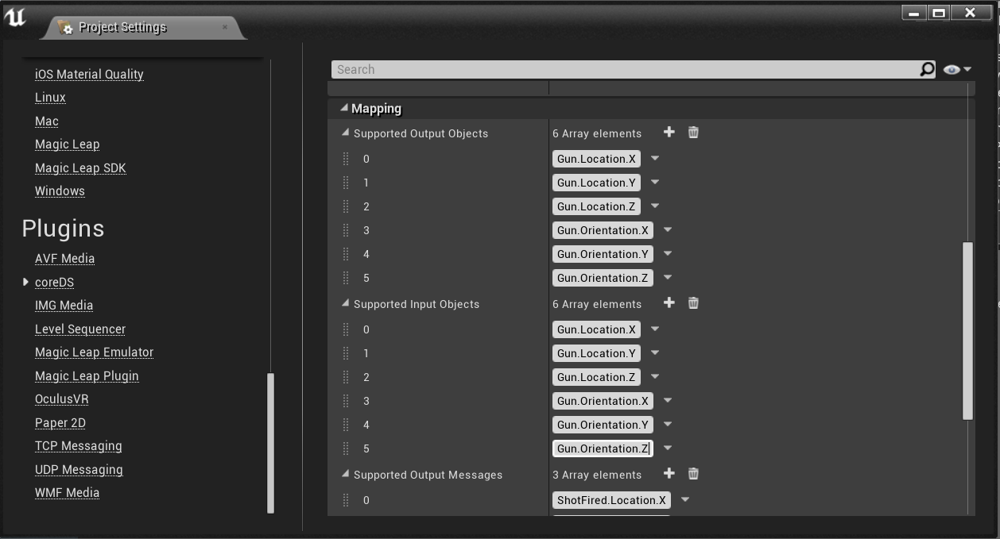

The next step is to configure an actual connection with a Distributed Simulation protocol. coreDS supports HLA (High-Level Architecture and DIS (Distributed Interaction Simulation).

You can open the configuration window either by running the game or selecting the proper menu option, as shown below:

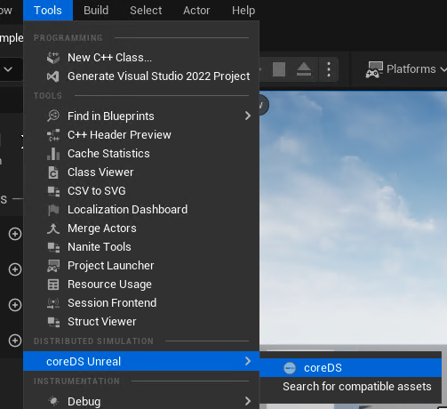

This sample comes with 4 pre-configured settings: 
   DIS_Player1: DIS v6
   DIS_Player2: DIS v6
   HLA_Player1: HLA 1516e with RPRFOM 2.0
   HLA_Player2: HLA 1516e with RPRFOM 2.0

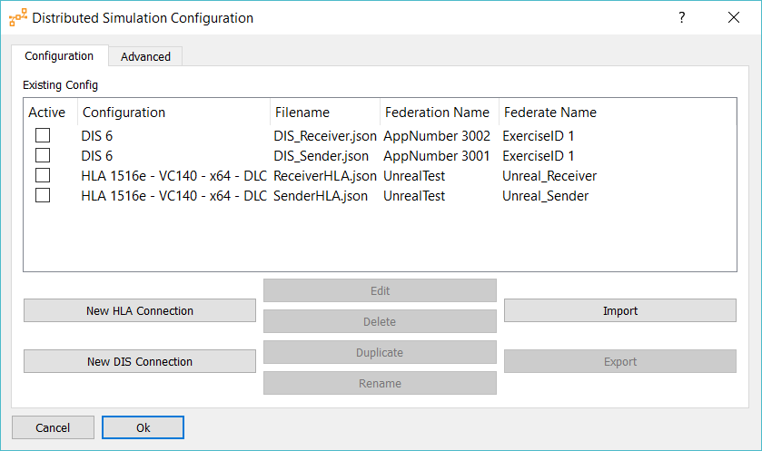

Let’s take a look at each configuration.

DIS
~~~

For both configurations, it is important to configure the Configured Network Adapter. Click on the dropbox and select your active Network Adapter.

.. image:: ./Doc/Images/DISConnectionConfiguration.png
   :alt: Plugin DISConnectionConfiguration Screenshot

Receiving
^^^^^^^^^

Even if DIS does not explicitly support Subscription, coreDS supports incoming filtering. First, we must let coreDS know that we want to receive the EntityStatePDU and the FirePDU.

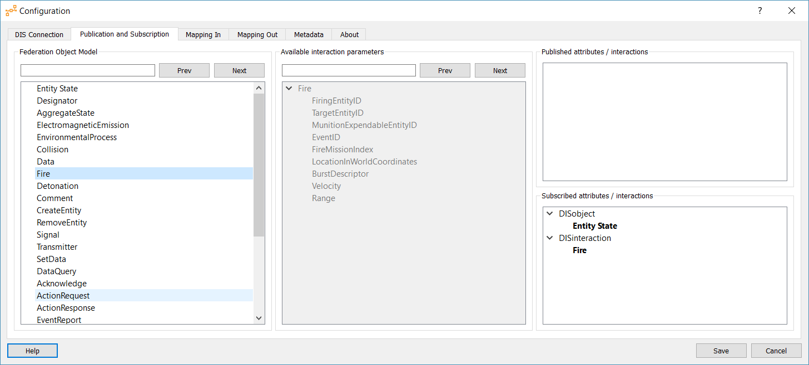

Then comes the Mapping configuration. Since we are in a receiver, we care about the “Mapping In”

The first step is to Map a Local Object/Message to a Protocol Object/Message. As you see, the Names you defined during the Plugin configuration are listed in the “+” list. You can then link the Local Object/Message to a Protocol Object/Message by using the drop-down m next to the Object/Message name.

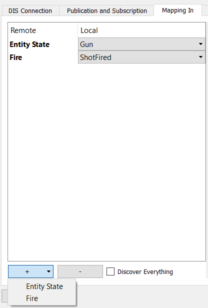

Then you must map the local properties to the protocol properties. Since we are in a receiving mode, we only care about the values we are interested in. In our case, we want to send back to Unreal the Location and the Orientation.

.. image:: ./Doc/Images/DISMappingIn_WithChoice.png
   :alt: Plugin DISMappingIn_WithChoice Screenshot

Finally, we are receiving coordinates in Geocentric format, which Unreal doesn’t like. We could convert the coordinates from within Unreal but by doing so, it will be harder to switch to a different Distributed Simulation Protocol. To keep everything configurable at runtime, we use the coreDS-embedded Lua scripting engine to convert from Geocentric to flat coordinates centred around a given Lat/Long.

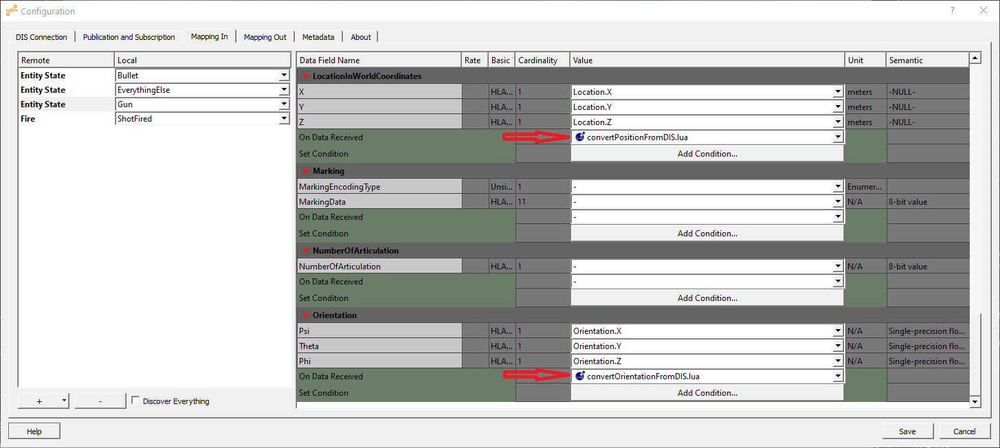

Below is the script that converts from Geocentric to local coordinates. Scripts are located in /Content/coreDS/Scripts

.. code-block:: lua

   require("ReferenceLatLongAlt")
   angleConversions = require("angleConversions")
   require("ecef2lla")

   function convertPositionFromDISToUnreal(value)

      -- Since we are working over a fairly small part of the planet, we can assume a flat surface
      a, b, c = EcefToEnu(value['LocationInWorldCoordinates.X']:toFloat(), value['LocationInWorldCoordinates.Y']:toFloat(), value['LocationInWorldCoordinates.Z']:toFloat(), referenceOffset_Lat , referenceOffset_Long , referenceOffset_Alt )

      --Convert geocentric to lat/long
      lat, long, alt = ecef2lla(value['LocationInWorldCoordinates.X']:toFloat(), value['LocationInWorldCoordinates.Y']:toFloat(), value['LocationInWorldCoordinates.Z']:toFloat())

      lat = 0.0174532925 * lat  -- convert to radian
      long = 0.0174532925 * long  -- convert to radian

      yaw = angleConversions.getOrientationFromEuler(lat, long, value['Orientation.Psi']:toFloat(), value['Orientation.Theta']:toFloat())
      pitch = angleConversions.getPitchFromEuler(lat, long, value['Orientation.Psi']:toFloat(), value['Orientation.Theta']:toFloat())
      roll = angleConversions.getRollFromEuler(lat, long, value['Orientation.Psi']:toFloat(), value['Orientation.Theta']:toFloat(), value['Orientation.Phi']:toFloat())

      value['Orientation.Psi']:set(roll)
      value['Orientation.Theta']:set(pitch)
      value['Orientation.Phi']:set(yaw)

      --scale back from meter to cm
      value['LocationInWorldCoordinates.X']:set(b/100)
      value['LocationInWorldCoordinates.Y']:set(a/100)
      value['LocationInWorldCoordinates.Z']:set(c/100)

   end

You might have noticed that nowhere during the configuration process we used the Entity Kind to distinguish between a GUN and a BULLET. coreDS supports complex filtering by leveraging the LUA scripting engine. To filter the GUNs, we’ve created a simple script, FilterGun.lua, which will check the EntityKind property and instruct coreDS to discard the mapping if this is not the correct type.

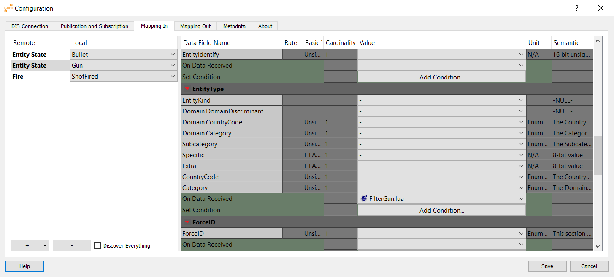

.. code-block:: lua

   require("__concatenateEntityType")

   function startswith(text, prefix)
      return text:find(prefix, 1, true) == 1
   end

   function FilterGun (value)
      -- if Plateform of type munition
      
      entitykind = __concatenateEntityType(value)
         
      if(startswith(entitykind, "3.1.") ~= true) then
         return true
      end
   end

Sending
^^^^^^^

Then, we must let coreDS know that we want to send the EntityStatePDU and the FirePDU.

.. image::  ./Doc/Images/DIS_Sender_PubSub.png
   :alt: Plugin DIS_Sender_PubSub Screenshot

Then comes the Mapping configuration. Since we are in a Sender, we care about the “Mapping Out”

The first step is to Map a Local Object/Message to a Protocol Object/Message. As you see, the Names you defined during the Plugin configuration are listed in the “+” list. You can then link the Local Object/Message to a Protocol Object/Message by using the dropbox next to the Object/Message name.

Then you must map the local properties to the protocol properties. Since we are in a Sender mode, we must fill the complete structure. Static values can be set at this point. We will map Location and Orientation to local properties.

Finally, we are sending coordinations in local format, which DIS doesn’t like. We could convert the coordinates from within Unreal but by doing so, it will be harder to switch to a different Distributed Simulation Protocol. To allow configuration at runtime, we use the coreDS embedded Lua scripting engine to convert from flat coordinates, centred around a given Lat/Long, to Geocentric.

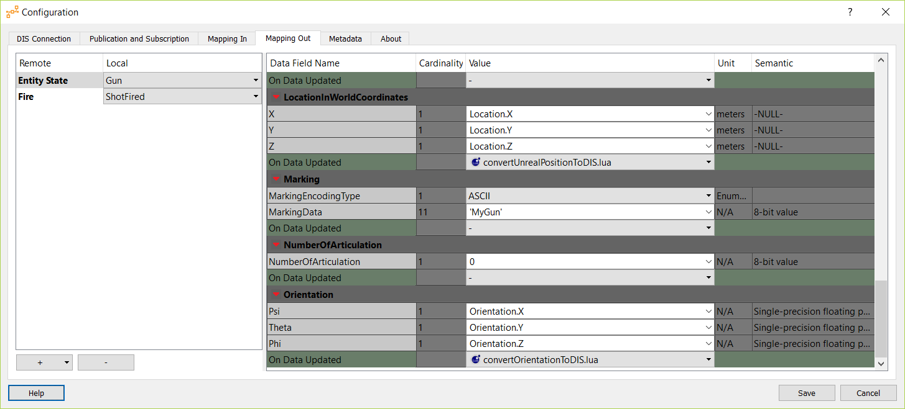

As for outgoing values, you must set a conversion script to convert from the local coordinates to geocentric coordinates. Scripts are located in /Content/coreDS/Scripts.

HLA
~~~

For both configurations, it is important to have a valid FOM File. The sample provides a RPRFOM 2.0 compliant FOM file, located in /Config. Although this sample is configured to use an RPRFOM-based FOM file, you can load the FOM file of your choice.

.. image:: Doc/Images/HLAConnectionConfiguration.png
   :alt: Plugin HLAConnectionConfiguration Screenshot

coreDS supports a wide range of RTIs, from the legacy DMSO RTI (HLA 1.3) to HLA 1516e compliant RTI like the Pitch RTI or MAK RTI. The complete list of supported RTI can be found here https://www.ds.tools/products/coreds/detailed-features-list/

If you are using the default configuration, you must select an Evolved-compliant RTI.

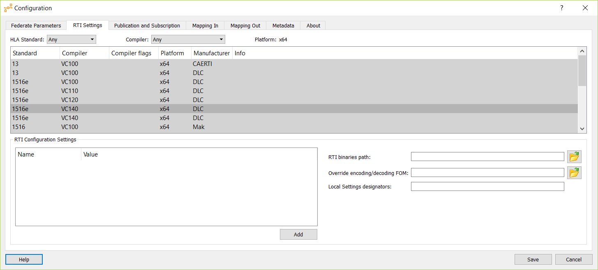

Receiving
^^^^^^^^^

First, we must let coreDS know that we want to receive the Statial attribute from a LifeForm and the WeaponFire interaction.

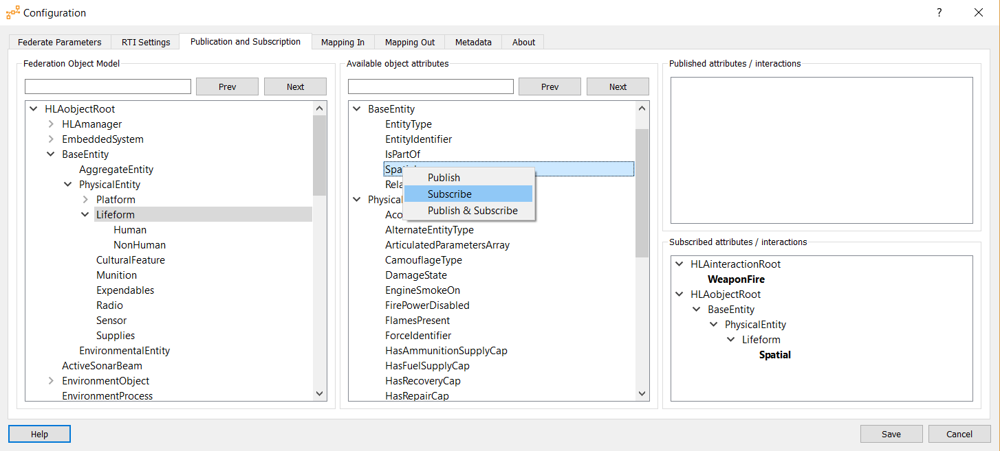

Then comes the Mapping configuration. Since we are in a receiver, we care about the “Mapping In”

The first step is to Map a Local Object/Message to a Protocol Object/Message. As you see, the Names you defined during the Plugin configuration are listed in the “+” list. You can then link the Local Object/Message to a Protocol Object/Message by using the dropbox next to the Object/Message name.

Then you must map the local properties to the protocol properties. Since we are in a receiving mode, we only care about the values we are interested in. In our case, we want to send back to Unreal the Location and the Orientation from the Spatial attribute.

Finally, we are receiving coordinates in Geocentric format, which Unreal doesn’t like. We could convert the coordinates from within Unreal but by doing so, it will be harder to switch to a different Distributed Simulation Protocol. To keep all the editable at runtime, we use the coreDS-embedded Lua scripting engine to convert from Geocentric to flat coordinates centred around a given Lat/Long.

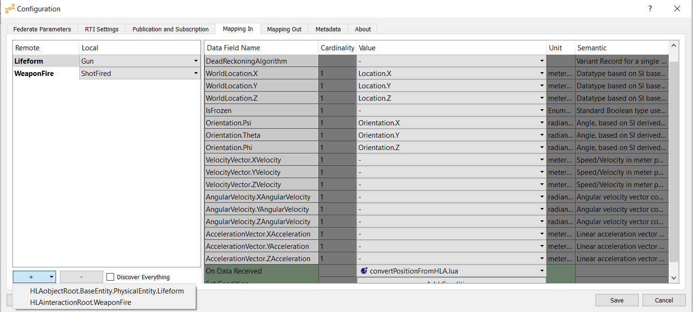

Below is the script that converts from Geocentric to local coordinates. Scripts are located in /Content/coreDS/Scripts

.. code-block:: lua

   angleConversions = require("angleConversions")
   require("ecef2lla")
   require("ReferenceLatLongAlt")

   function convertPositionFromHLAToUnreal(value)
      -- Since we are working over a fairly small part of the planet, we can assume a flat surface
      a, b, c = EcefToEnu(value['WorldLocation.X']:toFloat(), value['WorldLocation.Y']:toFloat(), value['WorldLocation.Z']:toFloat(), referenceOffset_Lat , referenceOffset_Long , referenceOffset_Alt )

      --Convert geocentric to lat/long
      lat, long, alt = ecef2lla(value['WorldLocation.X']:toFloat(), value['WorldLocation.Y']:toFloat(), value['WorldLocation.Z']:toFloat())

      lat = 0.0174532925 * lat  -- convert to radian
      long = 0.0174532925 * long  -- convert to radian

      yaw = angleConversions.getOrientationFromEuler(lat, long, value['Orientation.Psi']:toFloat(), value['Orientation.Theta']:toFloat())
      pitch = angleConversions.getPitchFromEuler(lat, long, value['Orientation.Psi']:toFloat(), value['Orientation.Theta']:toFloat())
      roll = angleConversions.getRollFromEuler(lat, long, value['Orientation.Psi']:toFloat(), value['Orientation.Theta']:toFloat(), value['Orientation.Phi']:toFloat())

      value['Orientation.Psi']:set(roll)
      value['Orientation.Theta']:set(pitch)
      value['Orientation.Phi']:set(yaw)

      --scale back from meter to cm
      value['WorldLocation.X']:set(b/100)
      value['WorldLocation.Y']:set(a/100)
      value['WorldLocation.Z']:set(c/100)

   end

Sending
^^^^^^^

First, we must let coreDS know that we want to send the Statial attribute from a LifeForm and the WeaponFire interaction.

.. image:: ./Doc/Images/DIS_Sender_PubSub.png
   :alt: Plugin DIS_Sender_PubSub Screenshot

Then comes the Mapping configuration. Since we are in a Sender, we care about the “Mapping Out”

The first step is to Map a Local Object/Message to a Protocol Object/Message. As you see, the Names you defined during the Plugin configuration are listed in the “+” list. You can then link the Local Object/Message to a Protocol Object/Message by using the dropbox next to the Object/Message name.

Then you must map the local properties to the protocol properties. Since we are in a Sender mode, we must fill the complete structure. Static values can be set at this point. We will map Location and Orientation to local properties.

Finally, we are sending coordinations in local format, which is not compliant with the RPRFOM Spatial attribute format. We could convert the coordinates from within Unreal but by doing so, it will be harder to switch to a different Distributed Simulation Protocol. To keep all the configurations editable at runtime, we use the embedded Lua scripting engine to convert from flat coordinates, centered around a given Lat/Long, to Geocentric.

.. image:: ./Doc/Images/HLAMappingOut.png
   :alt: Plugin HLAMappingOut Screenshot

As for outgoing values, you must set a conversion script to convert from the local coordinates to geocentric coordinates. Scripts are located in /Content/coreDS/Scripts.

Connect
-------

At some point, you must instruct your simulator to connect to the Distributed Simulation system (either HLA or DIS). When using DIS, a UDP socket will be created. When using HLA, a connection to the RTI will be attempted. If supported by the HLA version you are using, a call to connect() will be made, followed by a call to createFederationExecution (this call will be disabled from the HLA configuration) and joinFederationExecution. Once we have joined the Federation, we then set the various required states like time management, publish/subscribe, etc.

From the Level Blueprint:

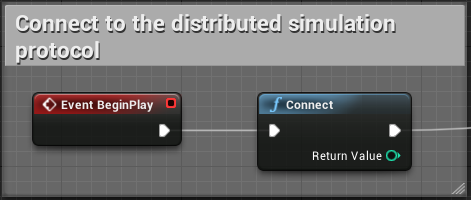

Disconnect
----------

When disconnecting, a DIS configuration will close the socket. HLA will call resignFederationExecution and destroyFederationExecution.

From the Level Blueprint:

.. image:: ./Doc/Images/BluePrintDisconnect.png
   :alt: Blueprint_Disconnect Screenshot

Send Update Object (send EntityStatePDU or UpdateAttributeValues, DiscoverObjectInstance)
-----------------------------------------------------------------------------------------

Sending an Object Update is fairly simple. You first have to build an array of <Name, Value> pairs then use the SendUpdateObject block. All names must match the names configured in the coreDS Unreal plugin.

When using HLA, if this is the first call using that object type, registerObjectInstance will be called, followed by UpdateObjectAttributeValues.

When using DIS, an EntityStatePDU will be sent.

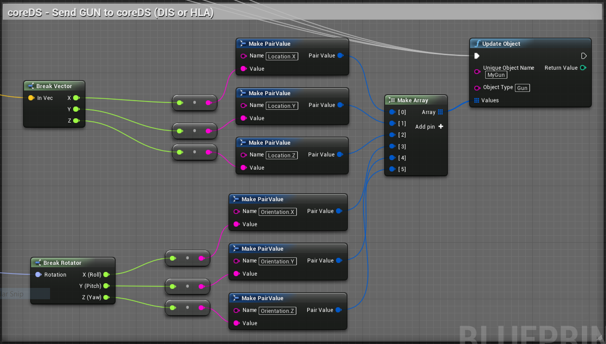

Send Message (send a MunitionDetonationPDU or SendInteraction)
--------------------------------------------------------------

Sending a message is fairly simple. You first have to build an array of <Name, Value> pairs then use the SendMessage block. All names must match the names configured in the coreDS Unreal plugin.

When using HLA, a call to SendInteraction will be made.

When using DIS, a FirePDU will be sent.

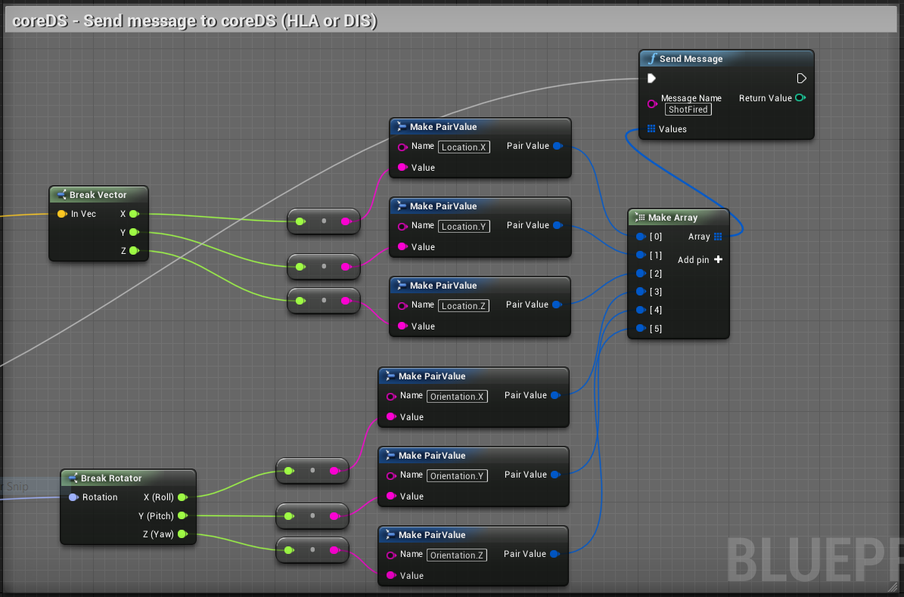

Receive Update Object (Receive EntityStatePDU or UpdateAttributeValues)
-----------------------------------------------------------------------

If you want to receive Object updates, you must first register an ObjectUpdateHandler. The registration must be done using the object name used in the coreDS Unreal plugin configuration:

.. image:: ./Doc/Images/BluePrintRegisterObjectUpdateHandler.png
   :alt: Blueprint_RegisteringObjectUpdateHandler Screenshot

Then, each time an object of the register type is received, the GunMoved event will be triggered.

In this particular case, we also added some logic to keep a list of discovered objects in Unreal. We first look into a map if the discovered object name already exists on the map. If not, a new Actor is spawned, else the Actor instance is updated. That part will most likely need to be updated based on your particular requirements.

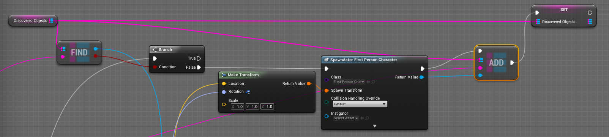

Below is a screenshot showing how to parse received information. As you will notice, the Property names are the same then the ones configurated in the “Getting started” part.

.. image:: ./Doc/Images/BluePrintReceiveObject.png
   :alt: Blueprint_ReceiveObject Screenshot

Receive Message (Receive a MunitionDetonationPDU or SendInteraction)
--------------------------------------------------------------------

If you want to receive a message, you must first register a MessageReceivedHandler:

Then, each time a message of the register type is received, the DetonationReceived event will be triggered.

.. image:: ./Doc/Images/BluePrintReceiveInteraction.png
   :alt: Blueprint_ReceiveInteraction Screenshot

Delete Objects (deleteObjectInstance)
-------------------------------------

If you are using DIS, at some point, you have to let coreDS know that a given object is no longer active; otherwise, coreDS will continue to send the keep-alive packet. For HLA users, the concept is more straightforward since you have to actively delete the Object from the federation.

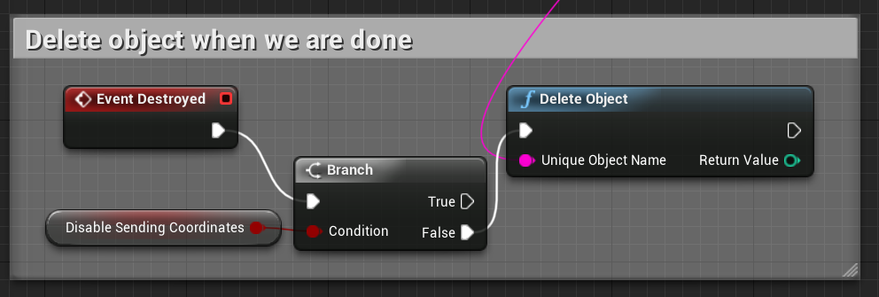

Detect Deleted Objects (EntityStatePDU timeout or RemoveObjectInstance)
-----------------------------------------------------------------------

At this point, you most likely understood how coreDS Unreal works! Let’s add a handler when objects are removed from the Distributed Simulation system. When using DIS, this happens when the EntityStatePDU is not updated for the last 5 seconds (or the configuration value in DIS 7). With HLA, the handler is called when a removeObjectInstance callback is received.

.. image:: ./Doc/Images/BlueprintRemoveObject.png
   :alt: Blueprint_BlueprintRemoveObject Screenshot

#Blueprint locations Everything related to receiving objects and messages(interactions) is located in the Level Blueprint.

Logic related to sending the GUN location is within the FirstPersonCaracter Blueprint.

Logic related to sending the FIRE message and updating the BULLET position is located in the FirstPersonProjectile Blueprint.

Overwriting to ErrorMessage handler
-----------------------------------

This block allows us to overwrite the default behavior of displaying the errors in the upper left side of the screen. In some cases, you might want to handle errors in a different UI.

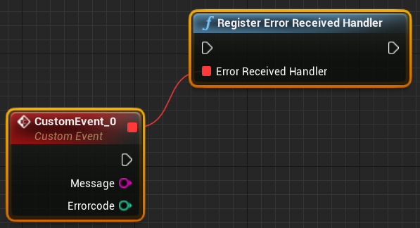

Setting your origin
-------------------

The Unreal coordinate system, basically a rectangle, needs to be converted to be sent to DIS and HLA (RPR-FOM). To do that, coreDS Unreal provides an easy mechanism.

To set your project origin coordinates (lat/lon), go to “Project Settings”, then “coreDS”:

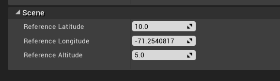
